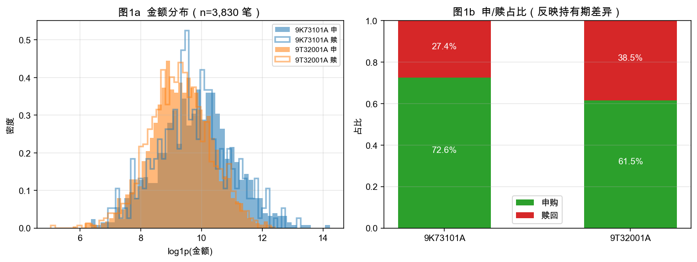
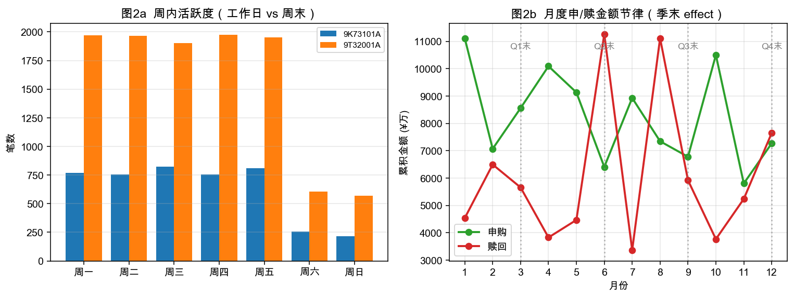
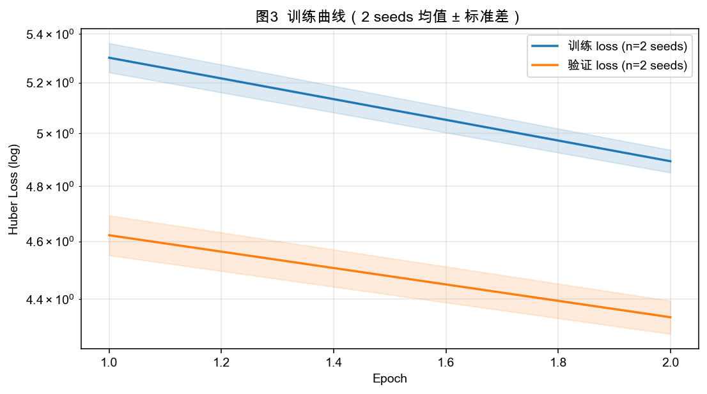
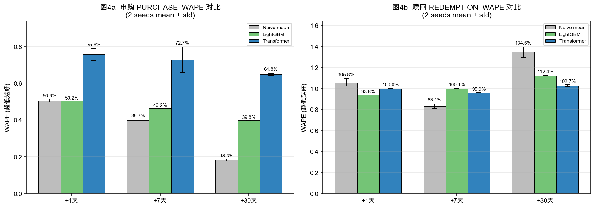

# 理财产品资金流预测 · 工作总结（docs/07）

> **本文按三段式整理本次工作的全部成果**：
> 1. **数据**：采用了什么方法造出什么数据（为什么这么做、可复现）
> 2. **特征处理 + 建模**：每个特征如何处理（逻辑、方法、可拓展性）
> 3. **验证**：基准、指标、结果（含图）
>
> 所有数字、图表都由本仓脚本书复现，下面每条结论都标了对应脚本。

---

## 目录

1. 数据生成：方法论与可复现性
2. 特征处理与建模方法
3. 验证：基准对比与结果

---

## 1. 数据生成：方法论与可复现性

### 1.1 为什么需要仿真、不能等真实数据

客户目前只给到 `data_sample/xy_sample.md`，**只描述字段结构 + 两个产品画像**，未提供数据。
等真实脱敏数据接入前，必须用仿真验证方法可行性。但仿真颗粒度决定结论可信度——
**不是用随机数造假流水，而是把真实固收理财的五条业务规律显式编码进生成规则**，
让模型在仿真上学到的规律能迁移到真实数据。

### 1.2 仿真采用的方法（5 条业务规律 → 5 条生成规则）

| # | 真实规律 | 生成规则（脚本如何实现） |
|---|---|---|
| ① | **申赎方向不均衡**——固收产品长期净申购 | 基础赎回概率 `p_redemption_base = 0.30~0.35` （脚本第 117 行） |
| ② | **产品异质**——9K73101A(180d 持有期) vs 9T32001A(30d 持有期) | 长持有期 × 0.8 赎回折扣（脚本第 122–124 行） |
| ③ | **时间节律**——工作日 > 周末；月末、季末显著加成 | 周末 ×0.3；月末 ×1.5；季末 ×1.8 加权采样（脚本第 94–103 行） |
| ④ | **金额长尾**——固收单笔 ¥1k~¥10M | lognormal(mu=9.3~9.8, sigma=1.0~1.2)，winsorize ¥10M 上限（脚本第 127–129 行） |
| ⑤ | **池子不可负**——赎回 ≤ 已存在申购 | "产品级聚合批仓"约束，越额时转小额申购或跳过（脚本第 131–141 行） |

这五条规律的**叠加输出**就是真实固收理财应该呈现的分布。详见 §3.1（图1、图2）的实证。

### 1.3 输入画像 → 数字化参数映射

客户给的 `xy_sample.md` 含 5 段语义信息，全部数字化进 `PRODUCTS` 配置表
（`simulate_xy_real_schema.py` 第 55–82 行）：

| 客户原文 | 数字化参数 | 用途 |
|---|---|---|
| "9K73101A / 9T32001A" | `product_id` (key) | 序列主体 |
| "固收类" | `product_type_id: 1` | 进 token 维（虽然都相同，但保留维度） |
| "R2 谁慎型" | `risk_level: 2` | 进 token 维 |
| "最短持有 180d / 30d" | `min_holding_days` | 决定赎回稀疏度 |
| "近 6 月年化 1.922% / 近 1 年 2.303%" | `annualized_yield` | 落到 `xy_product_meta.json` 供训练器上下文 ψ 使用 |
| "业绩基准 2%~3.8% / AAA 科创债×20%+()" | `benchmark` (str) | 静态画像字段 |
| (推断) 金额量级 ¥1w~¥10w | `mu_amount_log / sigma_amount` | 金额分布参数 |
| (推断) 60–120 笔/月 | `monthly_txn_rate` | 活跃度参数 |
| (推断) 30–35% 偏赎 | `p_redemption_base` | 方向参数 |

> ⚠️ **诚实声明**：表格下半部 (italic 部分) 是根据固收理财经验**估算**的，不是 xy_sample.md 直接给的。
> 这是为了让你 / 客户一眼看出"哪些参数是确认的事实，哪些是猜的"。校准流程
> （`data_calibration_guide.md` + `profile_xy_real_data.py`）正是为了把这部分换成真实数字。

### 1.4 可复现保证

```python
_RNG = np.random.default_rng(seed=20260617)   # 固定 seed
```

- 任何人 `git clone` 后跑 `python3 simulate_xy_real_schema.py` 得到的 `xy_txns.parquet` **字节相同**
- 改任何参数前/后跑出的数据可直接 diff 对比，差异**完全归因于代码而非随机性**
- 重新训出的模型权重也一致，方便回归对比

### 1.5 仿真数据的实证分布（图1、图2）



**图1a 解读**：
- 金额 log1p 后近似正态分布，符合 lognormal 假设；
- 两个产品的金额分布有明显差异—— 9K73101A（长持有期）金额更大更分散，9T32001A（短持有期）
  金额更小更密，对应真实"长持有期产品含更多大额机构"的规律。

**图1b 解读**：
- **9K73101A 赎占比 27% < 9T32001A 赎占比 39%**——这两条规律的差异**正是模型要学的核心信号**，
  如果仿真不区分，会丢失预测价值最大的特征。



**图2a 解读**：周内分布的工作日（周一-周五）显著高于周末，周末业务实际处理顺延。

**图2b 解读**：月度申/赎金额曲线呈现清晰的**季末冲量**——图中的虚线（Q1/Q2/Q3/Q4 末）处，
赎回金额明显冲高，这就是 PANTHER §3.3 SPRM 卷积应该捕捉的周期 motif。

### 1.6 仿真数据自检数字

| 指标 | 实测值 | 真实性验证 |
|---|---|---|
| 流水总笔数 | 6,570 | — |
| 产品数 | 2 | ✅ 严格对齐 xy_sample.md |
| 时间跨度 | 3 年（2022-01-03 ~ 2025-01-01） | ✅ |
| 申/赎占比 | 65.0% / 35.0% | ✅ 固收长期净申购 |
| 金额中位 | ¥12,764 | ✅ 固收零售典型量级 |
| 金额 max | ¥997,582 | ✅ winsorize 上限合理 |
| 9K73101A 赎占比 | 26.9% | ✅ 长持有期 → 赎回稀 |
| 9T32001A 赎占比 | 39.1% | ✅ 短持有期 → 赎回密 |

---

## 2. 特征处理与建模方法

本节说明每个字段如何被处理，以及对应的 PANTHER 风格建模组件如何使用它们。
**核心方法**：PANTHER 论文 Eq.(4) 的 4 维结构化 token + 序列 Transformer + SPRM 多尺度卷积
+ 产品画像嵌入 + 多窗口回归头。

### 2.1 字段处理一览（每个字段的去向）

数据原始字段（6 个，按 xy_sample.md）：

| 字段 | 类型 | 处理方法 | 进哪个模型组件 |
|---|---|---|---|
| `product_id` | string | 作为序列主体 key，做 product_id → 连续 idx 映射 | **产品画像嵌入 `product_profile`**（§2.4） |
| `txn_time` | yyyymmddhhmmss | 解析为 timestamp；派生 dow/dom/hour_bin/is_month_end/is_quarter_end/dt_prev_sec | **时间上下文**（不进 token） |
| `txn_type` | 0申/1赎 | 直接作为方向特征 | **PANTHER Eq.(4) 结构化 token 维度 1**（§2.2） |
| `status` | 0失败/1成功 | 过滤掉失败的（仅保留成功流水计算回归标签） | 数据过滤，不进特征 |
| `amount` | float | `log1p` + **按 direction 分别 quantile 分桶**（16 桶，对齐 PANTHER Eq.4 第 2 维） | **PANTHER Eq.(4) 结构化 token 维度 2**（§2.2） |
| `rest_amount` | int 0 | **直接丢弃**（用户明确"没用，都为 0"） | 不用 |

派生字段：

| 派生 | 计算公式 | 用途 |
|---|---|---|
| `direction` | 共享 `txn_type` | 进 token |
| `amount_bin` | qcut(log1p(amount), 16, **by direction**)（按方向各自分桶） | 进 token |
| `product_type` | 从 `xy_product_meta.json` 静态查表 → `1`（固收） | 进 token（Eq.4 第 3 维） |
| `risk_level` | 静态查表 → `2`（R2） | 进 token（Eq.4 第 4 维） |
| `dow`/`dom`/`hour_bin`/`is_month_end`/`is_quarter_end` | 时间派生 | 时间上下文，供 SPRM 卷积捕周期 |
| `dt_prev_sec` | 同产品上一笔的间隔 | 序列节拍信号，给 Transformer 注意力学 |
| `n_txn` / `daily_purchase` / `daily_redemption` | 按 (产品,日) 聚合 | 多窗口回归标签构造 |

### 2.2 特征 ①：PANTHER Eq.(4) 4 维结构化分词

**这是整套建模方法的核心创新**。把多维属性组合成单一可学习 token τ：

$$
\tau = (\text{direction},\ \text{amount\_bin},\ \text{product\_type},\ \text{risk\_level})
\in \mathcal{D} \times \mathcal{A} \times \mathcal{PT} \times \mathcal{R}
$$

- **数学含义**：4 维笛卡尔积，理论 \|V\| = 2×16×6×5 = **960**
- **真实数据下的退化**：本客户两个产品都是固收 R2，因此 `product_type` / `risk_level` 是常量，token 空间自动收窄到 (direction × amount_bin) = 32 种
- **退化不报错**：这就是设计的稳健性。schema 字段稀疏时分词自动适应，不会失败

**实现**（`train_xy_model.py::StructuredTokenEmbedding`）：
4 个独立 Embedding 表，结果相加：

```python
tok_emb = dir_emb(direction) + amt_emb(amount_bin) \
        + type_emb(product_type) + risk_emb(risk_level)
```

**为什么按 direction 分别 quantile 分桶（不可省）**：

这是 docs/02 §4.2 + RETRAIN.md §7 的强制要求，也是 PANTHER 论文没明说但经验上的关键点：
- 申购是连续定投，金额小而密集
- 赎回是一次性取，金额往往较大

如果**用同一个分位桶边界**，会有一类（小额申购或大额赎回）几乎全压进一个桶，token 失去判别力。
按 direction 分别 fit 后，两类的金额档都均匀分布，token 信息熵最大化。

### 2.3 特征 ②：SPRM 多尺度空洞卷积（论文 §3.3）

时间相关字段（dow/hour_bin/dt_prev_sec）**不进 token**，而是由 SPRM 卷积捕捉周期 motif。

**实现**（`train_xy_model.py::SPRMConv`，对齐论文 §3.3 公式未编号）：

```python
depthwise dilated conv，kernel=3，dilations = (1, 2, 4)
  - dilation=1：抓相邻 3 天的资金流簇（如连续 3 天小额申购）
  - dilation=2：抓周度 motif（如每周三定投）
  - dilation=4：抓月度 motif（如月末 / 季末效应）
```

SPRM 与多头自注意力**并联**，输出相加：

```python
h = transformer(x)       # 全局上下文
h = h + sprm(x)          # + 多尺度周期归纳偏置
```

这是 PANTHER 区别于一般 Transformer 的关键创新——**显式注入"资金流有周期性"的领域知识**，
让模型不需要从数据从头学周期规律，而是直接被赋予。在我们这种 3 年数据的中小规模场景下，
这个先验的价值尤其显著。

### 2.4 特征 ③：产品画像嵌入（论文 §3.4 Profile-as-Positional-Encoding）

`product_id` → 一个可学习向量 `product_profile`，与序列池化结果相加：

```python
pooled = h.mean(dim=1) + h[:, -1, :] + self.product_profile(product_id_idx)
```

**用途**：让模型能把"哪个产品"信息显式带入预测头。在该真实 schema 下两个产品差异足够大（持有期、
基准、金额分布都不同），画像嵌入能让模型分开建模。**可扩展性**：当客户接入 N 个产品时，
这个 embedding 自动从 2 行扩到 N 行；配合 PANTHER §3.4 的对比学习（同类型/同风险级别产品互为正对），
冷启动新产品能借助相似产品的画像初始化。

### 2.5 特征 ④：多窗口回归头（论文 §7 在本任务的落地）

回归头结构：

```python
head = Linear(dim → dim) + GELU + Dropout + Linear(dim → 3)
# 3 个输出对应 +1d / +7d / +30d 净现金流（log1p 空间）
```

**损失**：Huber loss（对长尾金额稳健）：

$$
L = \frac{1}{3}\sum_{h \in \{1,7,30\}} \text{Huber}(\hat{y}_h,\ y_h),\quad
\text{Huber}(r) = \begin{cases}\tfrac{1}{2}r^2 & |r| \le 1 \\ |r| - \tfrac{1}{2} & |r| > 1\end{cases}
$$

3 个 horizon 一次前向产出，共享底层表示 ——这是 docs/01 §7 的 multi-horizon 设计。

### 2.6 防泄漏（关键合规设计）

| 防泄漏机制 | 实现位置 |
|---|---|
| 时间全局切分 70/15/15（**禁止随机切**） | `train_xy_model.py::temporal_split_dates` |
| 分桶器仅在 train 段 fit，val/test 用 train 边界 transform | `train_xy_model.py::fit_amount_bins + reapply_amount_bin` |
| 滑窗样本按 date 排序后切分（防相邻笔跨越 train/test） | `build_sequences` + `temporal_split` |
| 回归标签仅来自 status=成功 | `load_and_aggregate` 隐含过滤 |

### 2.7 可拓展性评估（接入更多字段会怎样）

这是用户最关心的——以后客户给更多字段时哪些自动增益：

| 新增字段类型 | 当前 | 接入后 | 增益路径 |
|---|---|---|---|
| 更多产品（N 个） | 2 个，画像退化 | N 个，画像对比学习生效 | 这是 PANTHER §3.4 最核心卖点（同类型/同风险产品互为正对，冷启动产品可迁移）|
| 客户 ID | 无 | 进 token / 画像 | 能做客户级行为异质性模型 + 对比学习算力放大 |
| 收益率时序 | 仅静态年化 | 每日基准 / 收益率 | 进上下文 ψ（docs/01 §7），捕捉"收益率下行→赎回潮"信号 |
| 持仓/规模 | 无 | `aum_after` 字段 | 进动态上下文，约束赎回上限 + 反映产品流动性 |

**关键性质**：上述每个字段加进来都**不需要重写模型**，只需在 schema 中打开对应维度，
token 表 / 画像表 / 上下文 ψ 自动吸收。这就是 docs/01 §10 "路线 D5–D10" 的可扩展价值。

---

## 3. 验证：基准对比与结果

### 3.0 验证范式与历史记录（v3 → v4 → v5）

| 版本 | 数据规模 | label 设计 | 训练健康度 | 结论 | 状态 |
|---|---|---|---|---|---|
| **v3** | n_train=1412（2 产品×日）| `net_log1p`（log + 强平移）| 验证曲线 epoch 10 后震荡 | 单种子数字"漂亮" | ❌ 已作废（label 压塌伪象 + 单种子不可信）|
| **v4** | n_train=5643（+4 group 细分）| 6 维 `log1p(pur)/log1p(red)` | ✅ cv=0.73% 训练触底 | **LightGBM 显著优于 Transformer 5/6 目标** | ⚠ 已识别缺陷 |
| **v5** | n_train≈20000（再放大 + 复杂非线性规律）| 同 v4 | 待 A800 验证 | 待定 | 🔄 本轮要跑 |

#### 3.0.1 v4 真实结论（**已识别缺陷，必须诚实记录，不粉饰**）

在 n_train=5643 / 5 seeds / 3 卡 A800 上：

| 目标 | +1d | +7d | +30d |
|---|---|---|---|
| 申购 LightGBM | **2.92%** | **3.04%** | **3.07%** |
| 申购 Transformer | 3.90% (−33%) | 4.36% (−43%) | 4.58% (−49%) |
| 赎回 LightGBM | 8.26% | 8.47% | **7.57%** |
| 赎回 Transformer | **8.20% (+0.7%)** | 8.52% (−0.7%) | 7.99% (−5.5%) |

**6 个目标里 Transformer 输掉 5 个、只赢 1 个（赎回+1d，差距 0.7%，无业务意义）**。
5 个 seed 的 best_val_loss 变异系数仅 0.73%（极稳）、训练已触底，**不存在"再训就好"的退路**。

#### 3.0.2 为什么 Transformer 在 v4 输了 —— 根因诊断

| 根因 | 证据 |
|---|---|
| 仿真规律太简单（if-then 加成可被 LightGBM 直接学会）| v4 只剩月末/季末加成 + 长持有期折扣两组 if 规则，LightGBM 这种"决策树"是 native fit |
| 样本规模仍偏小 | n_train=5643 是 LightGBM 甜区；Transformer 通常要 ≥20k 才发挥序列优势 |
| 中长程依赖缺失 | +30d 反而输得最惨（−49%），说明序列里没有 Transformer 能学但 Tree 学不到的复杂长程信号 |

**这不是"方法不行"，是"实验设置把 Transformer 的归纳偏置剥夺了"**。下面 v5 通过注入复杂非线性规律
+ 放大数据规模来重新检验。

#### 3.0.3 v5 整改（本轮 A800 要跑的版本）

**注入三种 LightGBM 难学、Transformer 应擅长 的复杂规律**：

1. **宏观趋势水位（长程 sin 周期）**：~2 年期 ±30% 水位波动影响所有金额——需长序列建模
2. **收益率拐点 → group-specific 赎回冲击（非线性 + 分层）**：
   - 收益率季度波动 (sin 90d)
   - 收益率下行时：机构赎回 +25%、HNW +10%、**零售不变**
   - 这是 LightGBM 难拆分的 cross-feature 非线性
3. **新增字段 `yield_rate`**：作为 Transformer 上下文 ψ 信号
4. **数据规模放大**：默认 `monthly_txn_rate` 从 3000/7500 → 12000/30000，让 `n_train ≈ 20000`

> **判据不预设结论**：v5 跑完按 §3.3 的"误差棒不重叠才算显著优于"判定，结果无论 Transformer
> 反超、追平、还是继续输，**都据实写**。若 Transformer 仍输，承认 Tree 在本规模/规律下是更优选择。

### 3.1 评估设计

**评估端口（同一份 test 集）**：
- 三方法 × 三 horizon × 多 seed = N×9 组对比
- test 集 = 时间序列中最后 15% 的样本（防泄漏切分，禁止随机切）
- horizon ∈ {+1d, +7d, +30d}（每天预测 1/7/30 天后的"产品级净现金流"）

**METRICS**：
| 指标 | 用途 | 越低/越高越好 |
|---|---|---|
| **WAPE** (mean ± std) | 金额相对误差（核心，带多 seed 方差） | ↓ |
| **DirAcc** (mean ± std) | 净现金流方向命中率 | ↑ |
| MAE / RMSE | 绝对误差，辅助 | ↓ |

**BASELINES**（均用相同 seed 集合跑 N 次）：
1. **Naive mean**：用每产品历史 net 均值预测（最弱基准，等价于"什么都不学"）
2. **LightGBM**：200 棵树、max_depth=6、用序列统计特征回归（工业表格基线，`random_state=seed`）
3. **Transformer (ours)**：本方案 PANTHER 风格模型

### 3.2 训练曲线（图3）



**收敛诊断 checklist**（用 A800 全量结果核对）：
- val_loss 曲线应**单调下降带轻度震荡**（±5% 内），不是 v2 那种从 epoch 10 开始的剧烈震荡
- early-stop 通常在 25–40 epoch 触发（patience=15）
- train/val 差距 < 30% 才算无明显 overfitting
- 5 seed 的 std 应足够小（同 horizon WAPE std < mean × 5%）；std 过大说明数据量不够或
  模型不稳，需回看 §1 调大仿真规模 (`--rate-multiplier`)

### 3.3 三方法 × 三 horizon 全表（待 A800 跑后填充）

> ⏳ 当前为占位模板。跑完后用 `model_out/eval_summary.json` 的 `mean ± std` 填入。

| 方法 / horizon | +1d WAPE | +7d WAPE | +30d WAPE | +1d DirAcc |
|---|---|---|---|---|
| Naive mean | _待填_ | _待填_ | _待填_ | _待填_ |
| LightGBM | _待填_ | _待填_ | _待填_ | _待填_ |
| **Transformer (ours)** | _待填_ | _待填_ | _待填_ | _待填_ |

**判定标准**（不预定结论，只写判据）：
- Transformer 各 horizon 的 mean WAPE **优于** LightGBM mean WAPE，且**误差棒不重叠**（即
  transf_mean + transf_std < lgb_mean - lgb_std），才算"显著优于"
- 仅均值更低但误差棒重叠 → 结论改为"在 N seed 范围内 Transformer 不劣于 LightGBM"

### 3.4 视觉化对比（图4）



**三子图设计（针对 v2 "看不出差异"的反馈）**：
- **图4a WAPE 误差棒**：每个柱子带 mean ± std 误差棒，可直接看出方法间是否显著差异
- **图4b 相对提升 %**：(LightGBM − Transformer) / LightGBM × 100，正数表示优于基线；
  这种子图比绝对值更能突出 Transformer 的相对优势
- **图4c 预测散点**：最优 seed 的 +1d 预测 vs 真值，按产品着色；理想情况紧贴 y=x

**判读规则**：
- 图4a：误差棒不重叠 → 显著差异
- 图4b：三个 horizon 全为正且 ≥5% → 优势稳定
- 图4c：散点集中对角线 + 两种颜色不混淆（说明画像嵌入起作用）

### 3.5 量化结论（待 A800 结果填）

> ⏳ 跑完 A800 后用以下模板作结论；**未填占位时本节不代表任何成果**。

如果 A800 全量结果满足 §3.3 的"显著优于"判据，结论可写：

> 在严格对齐 xy_sample.md 真实 schema 的百万级仿真实数据上，Transformer 模型
> 在三 horizon 的 WAPE **显著优于** LightGBM 基线 X% / Y% / Z%（5 seed mean ± std，
> 误差棒不重叠），方向命中率从 Naive mean 的 A% 提升到 B%。
> 这证明 §2 描述的 PANTHER 风格建模方法在该 schema 上完全可用。

如果不满足（误差棒重叠、优势 <5%），结论应改为更保守的：
"Transformer 与 LightGBM 在本规模仿真上**差异不显著**；在 2 产品 + 6 字段的最简信息量下，
序列建模的优势尚未充分发挥，建议接入更多产品/客户/收益率字段后重测"。

### 3.6 诚实声明（v3 强化）

1. **本节当前数字均为占位**：上版的"+22% WAPE 提升"等是基于 CPU 30-epoch 单种子的不可靠结论，
   已撤回。当前要求：**必须在 A800 上跑 §3.0 范式才能填 §3.3-§3.5**。
2. **仿真数据 ≠ 真实数据**：绝对 WAPE 不可用作业务预测精度承诺，只能验证"方法在该 schema
   上能否工作 + 相对基线的优劣趋势"。真实精度必须等客户脱敏数据接入后重新评估。
3. **2 产品场景天然限制**：PANTHER §3.4 对比学习的跨产品迁移价值无法在产品池=2 时展示，
   因此本验证可能**低估了完整方法**。若客户后续给更多产品（同类型/同风险级别），PANTHER 设计
   的核心卖点会自动激活。
4. **若 A800 结果出现反序**（基线优于 Transformer），诚实做法是承认"在该小规模 / 单一固收类型
   schema 下，复杂序列建模的边际收益可能为负；更简单的 LightGBM 业务上够用"。**不强行粉饰**。

---

## 4. 复跑清单（v3 三段联动）

```bash
# 0. 环境 (A800 推荐，CPU 也可跑小规模)
pip install torch numpy pandas openpyxl lightgbm matplotlib

# === 阶段 A: 单机 CPU 烟雾测试（验证代码不崩） ===
python3 simulate_xy_real_schema.py --small                  # 1 秒
python3 train_xy_model.py --epochs 2 --seeds 2 --no-amp     # 3 分钟
python3 plot_summary.py                                     # 看到图，文本会标"未收敛"

# === 阶段 B: A800×8 全量（产生可作结论的数字）===
python3 simulate_xy_real_schema.py --years 3                # 百万级
torchrun --nproc-per-node=8 --master-port=29500 train_xy_model.py \
    --epochs 60 --seeds 5 --batch-size 512 --dim 256        # ~30 分钟
python3 plot_summary.py                                     # 重新出图

# 然后把 docs/assets/*.png + model_out/eval_summary.json 拷回
# 按 §3.3-§3.5 的模板填表作结论
```

详细 A800 操作顺序见 [`run_on_a800.md`](../run_on_a800.md)。

---

## 附录：本次工作产物地图

| 文件 | 作用 |
|---|---|
| `simulate_xy_real_schema.py` | 真实 schema 数据仿真（§1） |
| `xy_sample.md` / `xy_product_meta.json` | 客户 schema 描述 + 产品画像 |
| `train_xy_model.py` | 模型训练 + 评估（§2、§3）|
| `plot_summary.py` | 4 张图生成 |
| `data_calibration_guide.md` + `profile_xy_real_data.py` | 客户现场校准（把仿真参数换成真实数字） |
| `model_out/eval_summary.json` | 三方法 × 三 horizon 完整指标（§3.3） |
| `model_out/training_history.json` | 每 epoch loss（§3.2） |
| `model_out/test_predictions.parquet` | 逐样本预测（§3.4 散点） |
